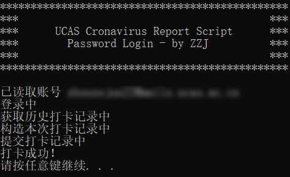
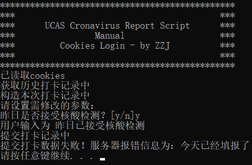
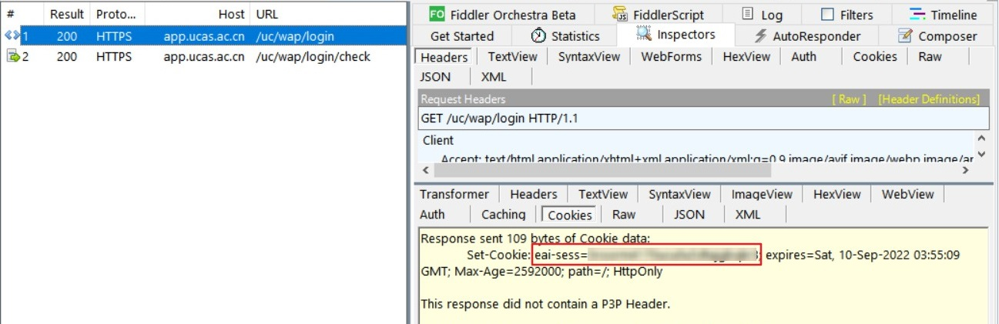
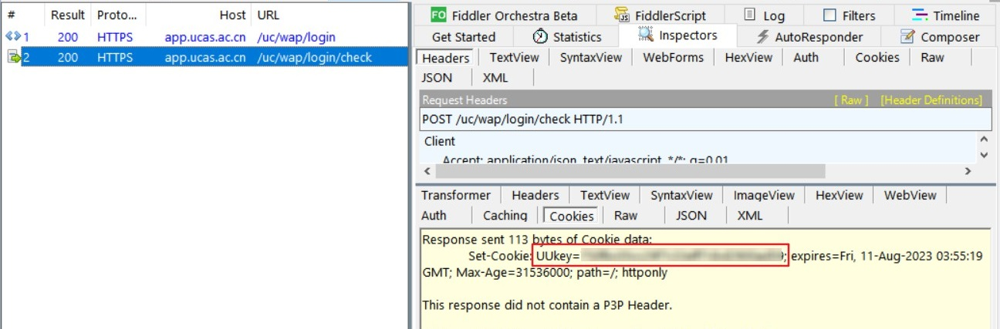
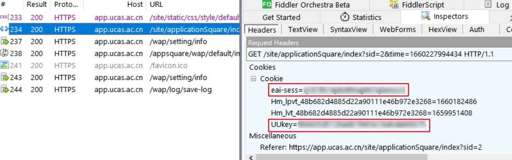
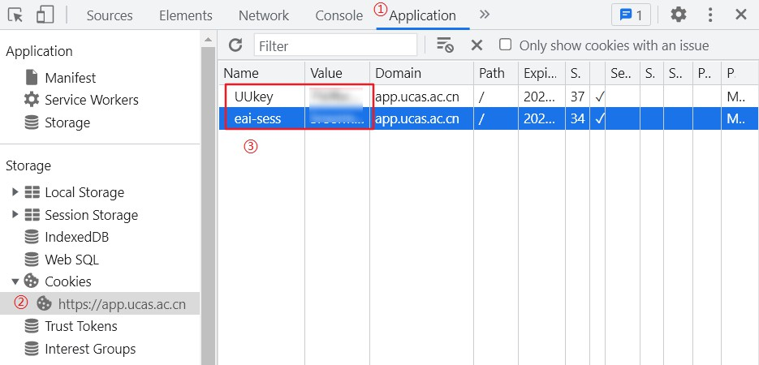

# ucas_cronavirus_report

适用于国科大企业微信平台的疫情每日打卡脚本。

**原理：**

基于上次打卡记录构造本次打卡记录，因此仅适用于无异常情况时的打卡，如打卡信息有变动请手动打卡。（注：考虑到最近“昨日是否接受核酸检测”一项会经常变更，故新增了在昨日记录的基础上，支持手动修改该项的脚本，详见[脚本入口说明](#脚本入口说明)）

**运行演示：**

| 自动打卡(账号密码登录)           | 可手动修改参数(cookies登录)             |
| -------------------------------- | --------------------------------------- |
|  |  |

**注意：**

由于脚本需要登录sep系统，故（只会在本地）用明文存储用户名和密码。

如果担心安全问题或无法正常登录，也提供了使用cookies登陆的方法，详见[脚本入口说明](#脚本入口说明)。

获取cookies的方法见[获取cookies](#获取cookies)。

## 目录

1. [脚本入口说明](#脚本入口说明)
2. [运行脚本](#运行脚本)
3. [用户信息配置](#用户信息配置)
4. [实现自动化](#实现自动化)

## 脚本入口说明

<style type="text/css">
.tg  {border-collapse:collapse;border-spacing:0;}
.tg td{border-color:black;border-style:solid;border-width:1px;font-family:Arial, sans-serif;font-size:14px;
  overflow:hidden;padding:10px 5px;word-break:normal;}
.tg th{border-color:black;border-style:solid;border-width:1px;font-family:Arial, sans-serif;font-size:14px;
  font-weight:normal;overflow:hidden;padding:10px 5px;word-break:normal;}
.tg .tg-0pky{border-color:inherit;text-align:left;vertical-align:top}
</style>
<table class="tg">
<thead>
  <tr>
    <th class="tg-0pky">数据构造方式</th>
    <th class="tg-0pky">登陆方式</th>
    <th class="tg-0pky">脚本名</th>
    <th class="tg-0pky">备注</th>
  </tr>
</thead>
<tbody>
  <tr>
    <td class="tg-0pky" rowspan="2">自动复制昨日报告</td>
    <td class="tg-0pky">使用账号密码登录</td>
    <td class="tg-0pky"><code>report.py</code></td>
    <td class="tg-0pky"></td>
  </tr>
  <tr>
    <td class="tg-0pky">使用cookies登录</td>
    <td class="tg-0pky"><code>report_cookies.py</code></td>
    <td class="tg-0pky"></td>
  </tr>
  <tr>
    <td class="tg-0pky" rowspan="2">可手动修改参数</td>
    <td class="tg-0pky">使用账号密码登录</td>
    <td class="tg-0pky"><code>report(manual).py</code></td>
    <td class="tg-0pky" rowspan="2">目前只支持修改“昨日是否接受核酸检测”，其他参数修改请手动填报。</td>
  </tr>
  <tr>
    <td class="tg-0pky">使用cookies登录</td>
    <td class="tg-0pky"><code>report(manual)_cookies.py</code></td>
  </tr>
</tbody>
</table>

对于可手动修改参数的脚本，可以在调用时传入参数`y`或`n`，则不需要在执行过程中手动输入该参数，方便实现自动化。

## 运行脚本

### 用可执行文件运行

本脚本已打包成exe可执行程序，请在[releases](https://github.com/barryZZJ/ucas_cronavirus_report/releases)页面下载。

### 用python3运行
1. 配置环境

   ```
   pip install requests
   pip install easydict
   ```

2. - 运行入口脚本（用户名密码登录）

     ```sh
     python3 <入口脚本名>.py
     ```

   - 对于含`manual`的脚本，可提前传入参数值`y`或`n`表示昨日是否接受核酸检测

     ```sh
     python3 report(manual).py y
     ```

## 用户信息配置

首次运行时会要求输入sep系统用户名和密码（或cookies），并生成ini配置文件。

如果不小心输入了信息，可以修改`user.ini`（或`user_cookies.ini`）中的信息，或直接删除ini文件，重新运行脚本。

### 获取cookies

打卡系统需要`eai-sess`和`UUKey`两个cookie。

可以使用抓包软件获取，或手动从浏览器中获取。

<details>
    <summary>抓包软件获取cookies</summary>
    <ol>
        <li>安装抓包软件：我使用的是<a href='https://www.telerik.com/fiddler'>fiddler classic</a>，安装与使用教程请自行上网搜索，注意需要安装证书才能抓取https报文。</li>
        <li>
            <ul>
                <li>抓PC端的包：用浏览器打开https://app.ucas.ac.cn/uc/wap/login，抓取登录时的POST报文，既可获得两个cookie。如图：
                    <br>
                    
                    <br>
                    
                </li>
                <li>抓手机端的包：参考<a href='https://www.cnblogs.com/mmz-tester/p/11125007.html'>这篇博客</a>分别配置好PC端和手机端后，在手机上点开国科大企业微信——A疫情防控，然后随便找一个域名是<code>app.ucas.ac.cn</code>的报文，就能看到所需的cookie了。如图：
                    <br>
                    
                </li>
            </ul>
        </li>
    </ol>
</details>

<details>
    <summary>从浏览器中获取cookies</summary>
    <p>使用浏览器打开<a href='https://app.ucas.ac.cn/uc/wap/login'>https://app.ucas.ac.cn/uc/wap/login</a>，登录后在开发者工具里找到cookie。</p>
    <p>以Chrome为例，按下F12后，Application——左侧找到Cookies下拉菜单——选择ucas的域名。如图：
        <br>
        
    </p>
</details>

## 实现自动化
如果要挂服务器的话，可以自行魔改，记得把脚本里最后的`os.system('pause')`删掉。

### Windows

任务计划程序。可参考[Windows创建定时任务执行Python脚本](https://blog.csdn.net/u012849872/article/details/82719372)。

### Linux
使用`crontab`。可参考[Linux crontab 命令](https://www.runoob.com/linux/linux-comm-crontab.html)。

示例：每天早上8点运行脚本：

`0 8 * * * python3 report.py`
